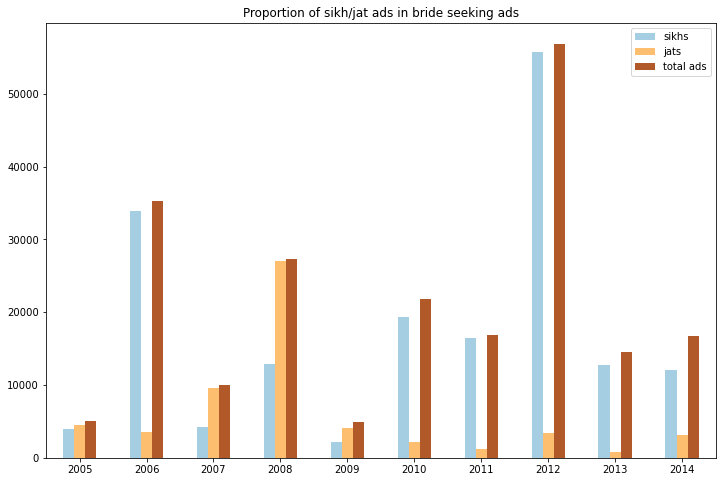
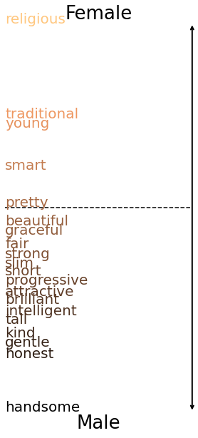
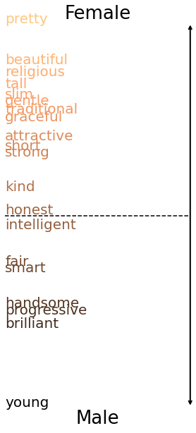

The code and data in this repository are a preliminary step towards the final objective of understanding the structure, trends, relevance,and success of matrimonial advertisements in the Indian context, throught this project. While this repository currently contains advertisements for prospective brides and grooms from the year 2001 to 2009, and 2014, the final project will also have data for 2010, 2011, 2012, and 2013.These years are slightly difficult to scrape owing to changes in the website. The data for grooms can be found under ```grooms_data``` in the folder ```data```, and the data for brides can be found under ```brides_data``` in the folder ```data```.

The code is written in Python 3.9.10 and all of its dependencies can be installed by running the following in the terminal (with the requirements.txt file included in this repository):

                         pip install -r requirements.txt
                         
Then, you can import the analysis and plot_num_ads module located in this repository to reproduce the analysis in the project that this code supplements (in a Jupyter Notebook, like README.ipynb in this repository, or in any other Python script):

### Findings
It is extremely challenging to reproduce the tables generated in first section of the results section. This is because the analysis involves running a code for individual years and then synthesizing relevant words and presenting them in a tabular format. However, you can generate year-wise proper nounns and top three character words for either category of ads for any year as shown below.


```python
analysis.final_func('data/brides_data/brides-wanted_2008.csv')
```


    

    


    

    


The above commands can easily be run for any of the files from the data folder to reproduce other analyses.


You can use the file ```sikh_jat_ads.py``` to successfully generate the first figure of the paper. You can also run the command below to generate the plot.


```python
import sikh_jat_ads
```


```python
sikh_jat_ads.plot()
```


    

    


You can run use the file ```KL_divergence_grooms.py``` and ```KL_divergence_brides.py``` to generate the heat maps in figure 2. You can also run the following command to generate the results.


```python
import KL_divergence_brides
```


```python
KL_divergence_brides.heat_map()
```


    

    


You can run the same command using ```KL_divergence_grooms``` to generate the second heatmap.

You can generate the projections in Figure 3 and Figure 4 using the files ```groom_projection_adjectives.py```, ```groom_projection_occupations.py```, ```brides_projection_adjectives.py```, and ```bride_projection_occupations.py```. You can run the commands below to generate the results.


```python
import groom_projection_adjectives
```


```python
groom_projection_adjectives.final_plot()
```


    

    


You can run the same command on ```groom_projection_occupations.py``` to generate the projection of occupational words.


```python
import brides_projection_adjectives
```


```python
brides_projection_adjectives.final_plot()
```


    

    


You can run the same command on ```bride_projection_occupations.py``` to generate the projection of occupational words.


You can also find the embedding models trained on bride and groom seeking advertisements under ```brides_wanted``` and ```grooms_wanted``` respectively.
